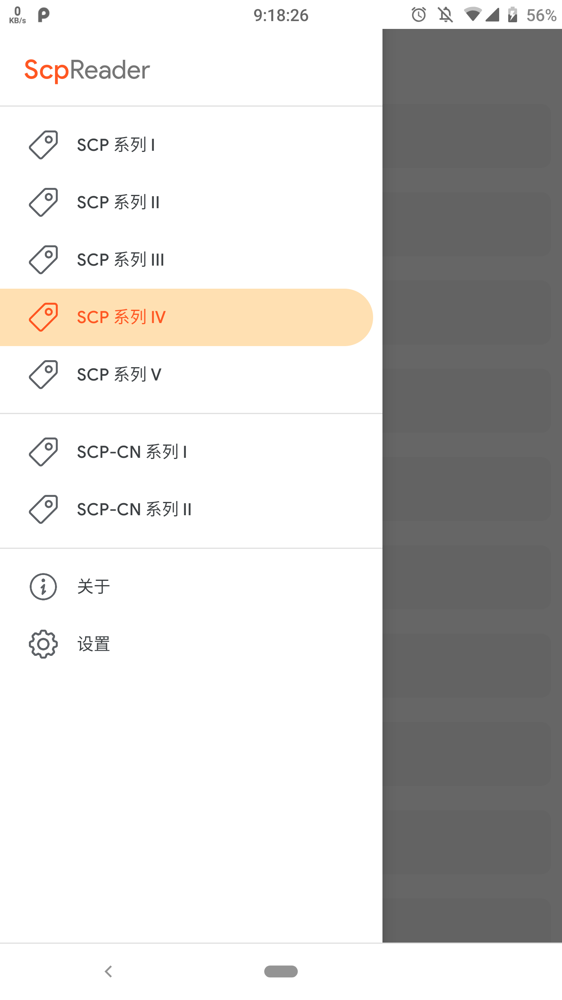
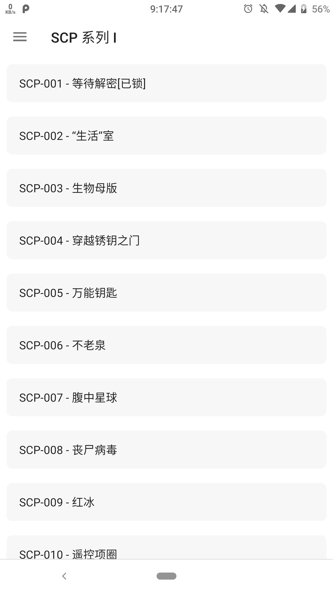
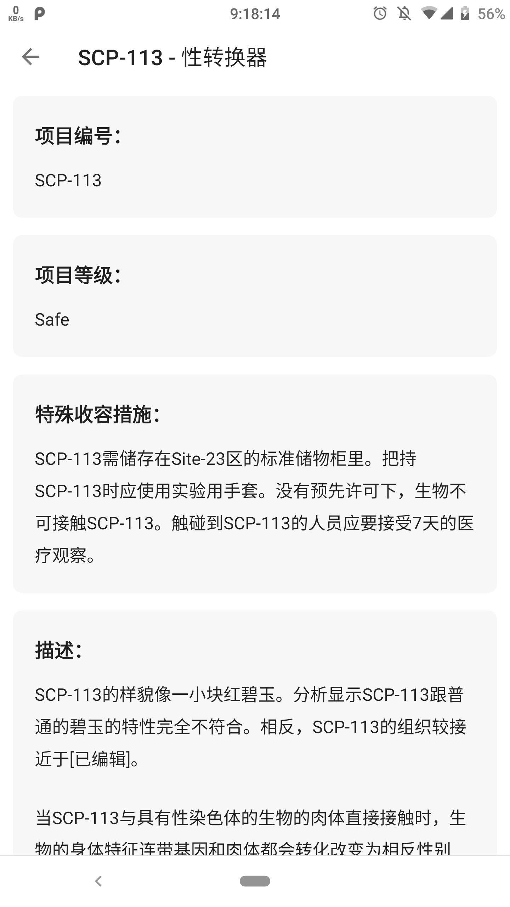

## ScpReader - 开源 SCP 条目阅读器
### 关于项目
本项目旨在开发一个比较符合自己阅读习惯的 SCP 阅读器，其内容均来自 http://scp-wiki-cn.wikidot.com ，软件自身不提供任何的内容。
### 许可
SCP 相关内容采用 [**Creative Commons Attribution-ShareAlike 3.0 License**](http://creativecommons.org/licenses/by-sa/3.0/) 方式进行授权。
### Todo
很显然，本项目的完成度目前并不高。

由于  [ScpWikidot](http://scp-wiki-cn.wikidot.com)  内容页具有一定的多样性以及杂乱性，本项目还需要较为漫长的时间去逐步适配各种样式。

下一阶段的工作目标：
* [ ] 图片提取（画廊模式）
* [ ] 部分内容的点击事件处理
* [ ] 外部文档的优化阅读
* [ ] 完善「关于」页面

### 软件截图

 &nbsp;&nbsp;
 &nbsp;&nbsp;
 &nbsp;&nbsp;

